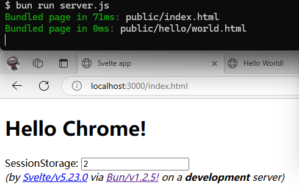

# svelte-bun

run svelte/v5 component in Bun's [Fullstack Dev Server](https://bun.sh/docs/bundler/fullstack).

# steps
> bun version >= 1.2.5 required

    $ curl -fsSL https://bun.sh/install | bash
    $ source ~/.bashrc
    $ git clone --depth 1 https://github.com/terrywh/svelte-bun.git
    $ cd svelte-bun
    $ bun add -D bun-plugin-svelte
    $ bun run server.js
