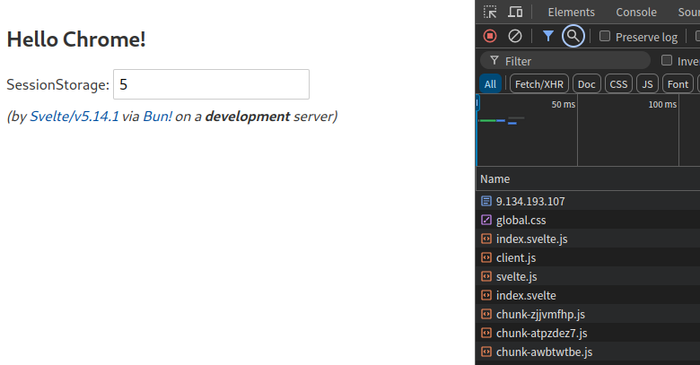

# sveltejs for bun
Just in time Component (Using only svelte on bun), compile svelte component on the fly; 
> for Development environment only.

# component
Add a component using `.svelte` as file extension, and import it.
> see `public/main.js` and `public/app.svelte`

# restful
Add a service using `.js` and export the handler, import it as the handler parameter of `createRestfulServer()`.
> see `service/hello.js` and `sbin/server.js`

